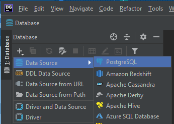
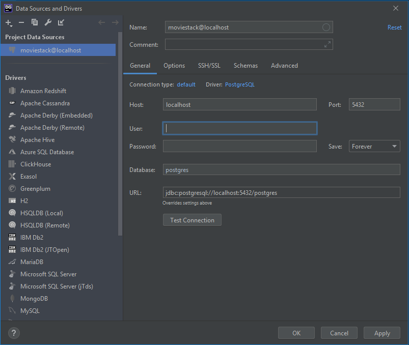
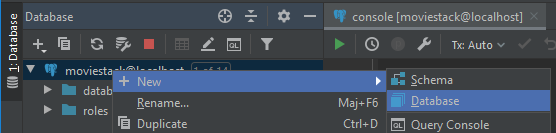
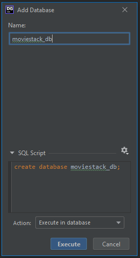
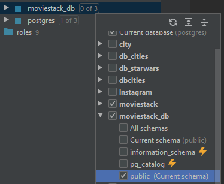
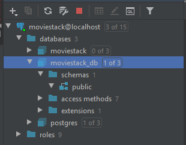
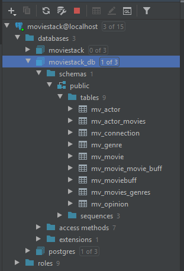

# Création de la base de données PostgreSQL

## Par DataGrip

Cliquez sur le "+" en haut du volet de `Database`, puis sur `Data Source` et enfin `PostgreSQL`

Dans la boite de dialogue qui s'ouvre, renseignez le champ `Name`, `Host`, `Port` comme suit :

Renseigner le champ `User` avec le login du compte administrateur PostgreSQL et le champ `Password` avec son mot de passe.

Cliquez ensuite sur `OK`.

Cliquez droit sur le nouveau Data Source, puis sur `New` et `Database`

Dans la nouvelle boite de dialogue, renseigner le nom de la nouvelle table à créer, ici `moviestack_db`.

Cliquez sur le bouton `Execute`.

Vous verrez votre nouvelle database dans le répertoire `databases`.

A droite de cette database, vous devez voir un petit bouton indiquant un `[0 of 3]`, cliquez sur ce bouton.

Cochez `public` dans les schemas sous le nom de votre database :

Le schema `public` sera visible :

Vous pouvez lancer le Backend à ce stade.

Une fois lancé le Backend, vous devez voir les tables sous le répertoire `tables` :

